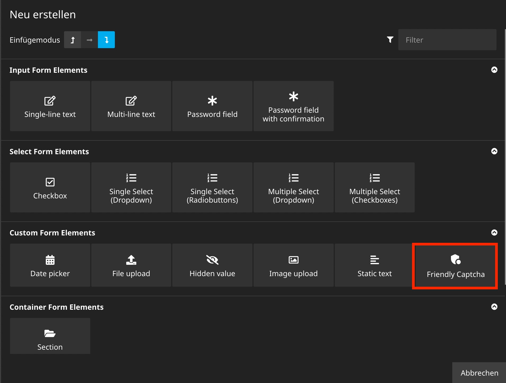

# Friendly Captcha V2 integration for Neos Form Framework

This package add a form element which integrates [Friendly Captcha v2](https://friendlycaptcha.com/) verification to your form.

**Please note: You need an Friendly Captcha account to use these package.**

## Prerequisites

The Friendly Captcha v2 must be activated. This must be done via the Friendly Captcha website.


## Installation

The package can be installed via Composer.

```bash
$ composer require ahorn/friendlycaptcha
```

## Updato from v1

Change `secretKey` to `apiKey`

## Configuration

You need to add your Site Key (`siteKey`) and API Key (`apiKey`) from you Friendly Captcha v2 account. You can specify the default widget language and when the widget should start solving the puzzle. Please have a look at the official [Friendly Captcha Widget API](https://developer.friendlycaptcha.com/docs/v2/) if you need more informations.

```yaml
Ahorn:
  FriendlyCaptcha:
    siteKey: 'add-you-site-key'
    apiKey: 'add-you-api-key'
    language: 'de'
    startVerification: 'auto'
    apiEndpoint: 'global'
    theme: 'auto'
```

### language
(30 October 2024)  


Current status can be found at <https://developer.friendlycaptcha.com/docs/v2/guides/localization>


### startVerification

* auto: `Default` the solver will start as soon as possible. This is recommended if the user will definitely be submitting the CAPTCHA solution (e.g. there is only one form on the page), this offers the best user experience.
* focus: as soon as the form containing the widget fires the focusin event the solver starts, or when the user presses the start button in the widget. This is recommended for webpages where only few users will actually submit the form. This is the default.
* none: the solver only starts when the user presses the button or it is programatically started by calling start().

### apiEndpoint

By default the widget fetches puzzles from https://global.frcapi.com/api/v2/captcha, which serves puzzles globally. As a premium service we offer an alternative endpoint that serves requests from datacenters in Germany only. 

* `eu`: Service requires a Friendly Captcha Advanced or Enterprise plan. Endpoint hosted in germany
* `global`: `Default`. Global service served from all over the world.

### theme

* `light`: A light theme (default).
* `dark`: A dark "night mode" theme.
* `auto`: `Default`Match the user's operating system or browser preference settings.

In production environment we strictly recommend to use environment variables to set the values.

## Add form element with Neos.Form.Builder

Create a new form in Neos backend. Add the new Friendly Captcha form element to you form.



## Language Support

The package supports language content dimensions and set the language of the widget based on the language dimension. At the moment the package support only 2 characters to identify the language.

## Override Settings

You can override the following configurations in the node properties:

* Site Key
* Api Key
* Language of the Widget
* Verification start
* Api Endpoint (if you have premium services)
* theme

## Error handling

We added some error codes for better error handling.
If you see an error code in the frontend it is most likely to be an configuration error.

* 1732156724: The X-API-Key header or apiKey not set.
* 5786245981: The apiKey is invalid.
* 7956325875: Sitekey is invalid.
* 1380742851: An unknown error has occurred. Check the settings.
